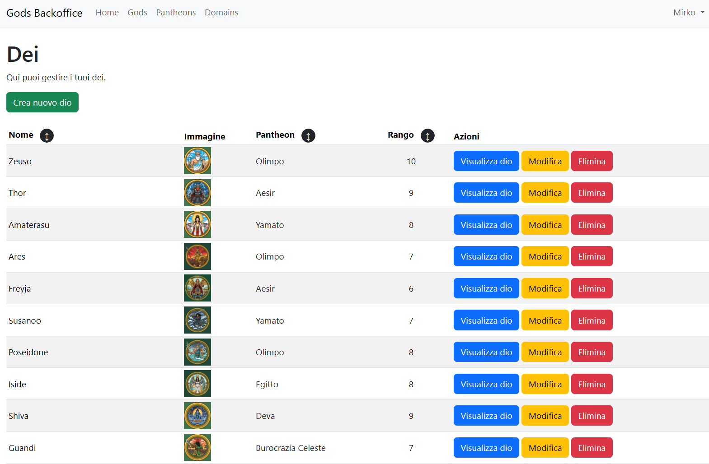

# Progetto Backoffice

Questo è il backoffice del progetto richiesto per l'esame di Boolean.
Come entità principale ho scelto Dei messa in relazione 1 a molti con Pantheon e molti a molti con Domini.

### Legenda
✅ completato
🔄 in corso
⏳ in attesa/bloccato
⬜ da fare

## Entità:

### Gods:
	name string unique
	title string (es. padre degli dei)
	image string nullable
	description text nullable
	rank  int 1 - 10 power level default 1
	pantheon_id fk pantheons

### Pantheons:
	name string unique (Olimpo, Aesir, Yamato)
	region string unique (grecia, giappone, scandinavia)
	home_base string unique (Monte Olimpo, Asgard, Takamagahara)
	image string nullable
	description text nullable

### Domains:
	name string unique (fuoco, fulmine, morte, saggezza)
	description text nullable
	color string (cod hex, es #FF5733)
	icon string (es. fa-bolt, fa-flame)

### Pivot domain_god:
	domain_id
	god_id

### Relations
-	Gods 1 X N Pantheons
-	Gods N X N Domains
 
## Todos:

### Setup ✅
- [X] Install laravel
- [X] Install breeze
- [X] Set database in .env
- [X] Set storage filesystem in .env
- [X] Set storage symlink

### Database ✅
- [X] God model & migration
- [X] Pantheon model & migration
- [X] Domain model & migration
- [X] 1xN
- [X] NxN
- [X] Pivot table
- [X] Pantheons seed
- [X] Domains seed
- [X] Gods seed
- [X] Pivot seed
- [X] Users seed

### UI ✅
#### Commons ✅
- [X] partials/Header
- [X] layouts/app
- [X] welcomePage

#### Gods ✅
- [X] index
- [X] show
- [X] create
- [X] store
- [X] edit
- [X] update
- [X] destroy

#### Domains ✅
- [X] index
- [X] show
- [X] create
- [X] store
- [X] edit
- [X] update
- [X] destroy

#### Pantheons ✅
- [X] index
- [X] show
- [X] create
- [X] store
- [X] edit
- [X] update
- [X] destroy

### Controller ✅
#### Admin ✅
- [X] admin/GodController (CRUD)
- [X] admin/DomainController (CRUD)
- [X] admin/PantheonController (CRUD)

#### Api ✅
- [X] api/GodController (R)
- [X] api/DomainController (R)
- [X] api/PantheonController (R)

### Routes ✅
#### Admin ✅
- [X] admin/GodController route (web)
- [X] admin/DomainController route (web)
- [X] admin/PantheonController route (web)

#### Api ✅
- [X] api/GodController route (api)
- [X] api/DomainController route (api)
- [X] api/PantheonController route (api)
